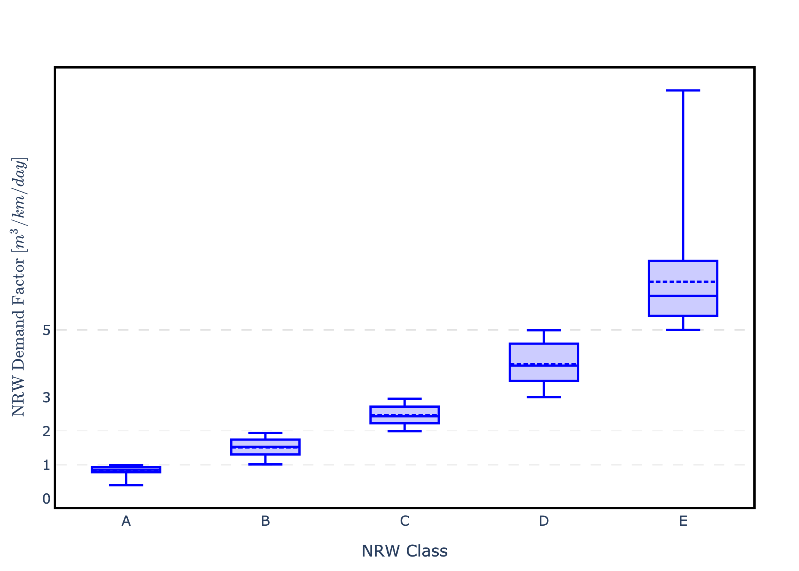
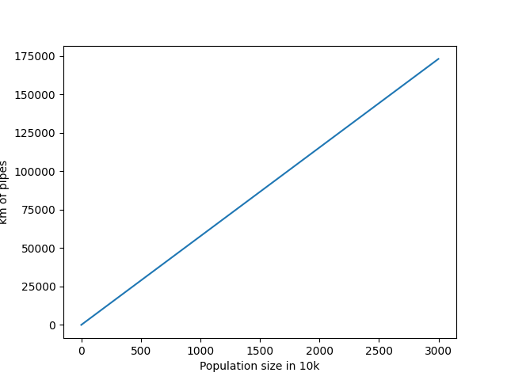

### Municipalities

Each municipality (gemeente) is represented as a single junction point with positive demand, abstracting the entire secondary and tertiary distribution network within that jurisdiction.
This node serves as the sole supply point for all water within the municipality's boundaries, with characteristics such as population, land area, and housing stock consolidated at this level.

The system presents two main challenges.
First, municipal parameters evolve over time as cities grow and change.
Second, the network topology itself is dynamic: municipalities can merge or be absorbed by larger neighbors, causing the number of nodes to vary throughout the planning horizon.

---

**Excursus on the Modelling Approach**

To model this administrative restructuring, municipalities can only open or close on January 1st of each year.
When a municipality closes, its delivery point disappears from the network.

*Absorption by existing municipalities*: When a municipality is absorbed by a larger neighbor that already exists, all attributes of the closing municipality (population, land area, housing stock, etc.) transfer to the destination municipality.
Any pipe that previously connected these two entities becomes hidden, as it formally becomes part of the destination municipality's internal distribution network.

*Clustering into new municipalities*: When multiple municipalities close and cluster together to form a new entity, all their delivery points disappear and a new supply point emerges at the location of the newly formed municipality.
The new municipality inherits all pipeline connections and attributes from the closing municipalities.
This modelling approach mirrors real-world dynamics in densely populated countries like the Netherlands.
When a new municipality forms through clustering, typically a new city center is established while former city centers become secondary neighborhoods.
These moments of urban reorganization present natural opportunities for water utilities to lay new connections and redesign substantial portions of the distribution system.

---

Municipalities have many attributes that influence the other modules of the system.
The full list can be seen in @tbl:muni-properties, while the actual values for these variables can be inspected within the data files, which are mapped in Appendix A.

| Property | Type | Scope | Unit |
| :--- | :--- | :--- | :--- |
| Name | Static | Municipality |
| Identifier | Static | Municipality |
| Latitude | Static | Municipality | degrees
| Longitude | Static | Municipality | degrees
| Elevation | Static | Municipality | m
| Province | Static | Municipality |
| Begin date | Static | Municipality | date
| End date | Static [Optional] | Municipality | date 
| End reason and destination | Static [Optional] | Municipality |
| Population | Dynamic Exogenous | Municipality | inhabitants
| Surface land | Dynamic Exogenous | Municipality | $km^2$ |
| Surface water (inland) | Dynamic Exogenous | Municipality | $km^2$ |
| Surface water (open water) | Dynamic Exogenous | Municipality | $km^2$ |
| Number of houses | Dynamic Exogenous | Municipality | units
| Average age distribution network | Dynamic Endogenous | Municipality | years

: Municipalities' properties review. {#tbl:muni-properties}

Along with these attributes, the only observable quantity for each municipality is the total water demand divided in its two components: consumption (delivered demand) and the quota of undelivered demand.

More precisely, the total water demand comprises two volumetric quantities, though this breakdown is not observable to participants:

- billable water demand (the sum of household and business water demands) described in @sec:water-dem, and
- non-revenue water (accounting for leaks, flushing, measurement errors and other losses), described in @sec:nrw.

Instead, only two outputs are observable: actual consumption and undelivered demand.
These two variables are extracted from an EPANET simulation of the network run in pressure-driven analysis (PDA) mode with a minimum pressure threshold of 30 m.
This threshold accounts for the requirement to deliver 20 m of pressure at the consumer tap, plus an allowance of 5 m pressure drop in the secondary network and 5 m in the tertiary portion.

#### Water Demand Model {#sec:water-dem}

The methodology developed to generate water consumption time series builds on historical data from the Dutch Drinking Water Statistics (Vewin, 2022), which provide nationwide trends in total drinking water production, sectoral water use, and non-revenue water over the period 2000–2024. Specifically, water-consumption time series generation is structured into three phases.

Phase I. The first phase estimates the annual water volume supplied to each municipality using information on households, and businesses, complemented by projected data where required. These annual volumes are calibrated to match national totals reported in official statistics and then randomized around the calibrated value to introduce variability among municipalities.

Phase II. In the second phase, representative hourly consumption profiles are assigned to each municipality using a library of year-long, normalized profiles derived from district-metered areas and pre-processed to remove leakage effects. In greater detail, for each municipality, two residential profiles are selected from the library according to municipality population class, while a single non-residential profile is drawn from a dedicated set.

Phase III. The third phase produces the final hourly time series by applying a Fourier series-based approach which combines seasonal modulation, climate-related adjustments, and random perturbations to capture temporal variability. The two residential profiles associated with each municipality are aggregated through weighted combinations, and both residential and non-residential profiles are scaled to match the previously estimated yearly volumes. The outcome is a set of 8,760-point hourly water consumption series for each municipality. 

#### Non-Revenue Water Model {#sec:nrw}

Our modelling of non-revenue water (NRW) relies on the average age of the pipe infrastructure in a municipality. Based on this average age, the municipality gets assigned to one of five possible classes (A - E) as follows:

| Age in years | Class | Lower and upper bound of NRW demand in m^3/day |
| ------------ | ------| ---------------------------------------------- |
| 0 - 25       | A     | (0, 12)                                        |
| 25 - 43      | B     | (12, 20)                                       |
| 43 - 54      | C     | (20, 35)                                       |
| 54 - 60      | D     | (35, 55)                                       |
| > 60         | E     | (55, inf)                                      |

Each class is associated with a distribution of non-revenue water (NRW)demands (e.g., leakages), from which we sample to generate the total demand, consisting of the normal demand + NRW demand. Notably, the NRW demand is different for each class -- i.e., older systems suffer from more leaks and therefore have a higher NRW demand. The distribution of NRW demands per class and km of pipes is illustrated in the following figure.

The total number of km of pipes in a given municipality is linked to its population size. Here, we use a linear relationship between the population size and the km of pipes, also illustrated in the following Figure:

$$
km\_pipes = 57.7 * population\_in\_10k
$$

| Property | Type | Scope | Unit |
| -------- | ------------- | ------------ |
| NRW demand | Static [Uncertain] | National | $m^3/day$
| Inner distribution network - length to population ratio | Static | National | $km/(10k inhabitants)$
| Inner distribution network - length | Dynamic endogenous| Municipality | km
| Inner distribution network - average age | Dynamic endogenous | Municipality | years
| NRW intervention - unit cost | Dynamic endogenous | NRWClass, Municipality Size Class, National | $€/year$
| NRW intervention - effectiveness factor | Static [Uncertain] | NRWClass, Municipality Size Class, National | 
| Intervention budget | Option |  | $€/year$
| Intervention policy | Option |  |

: Non-revenue water model's properties review. {#tbl:nrw-properties}